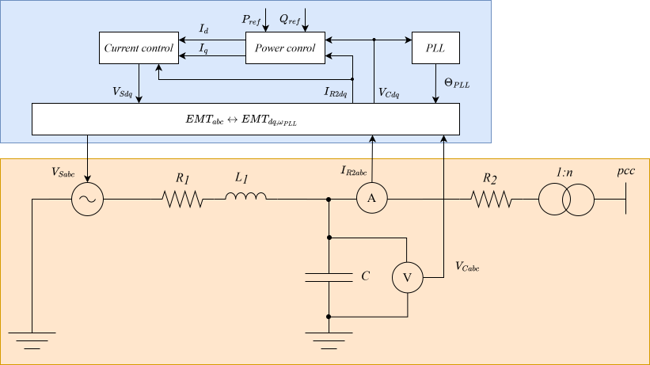

## Context
An electromagnetic transient (EMT) average value grid-following inverter model, described in [[1]](#1), was developed and implemented in [ModPowerSystems](https://git.rwth-aachen.de/acs/public/simulation/modpowersystems) and in [DPsim](https://github.com/sogno-platform/dpsim) by RWTH Aachen University, Germany. The EMT model was developed to serve as a benchmark in studies to compare simulation accuracy, numerical stability and performance against DP (dynamic phasor) model in large-scale grid simulations.

## Model use, assumptions, validity domain and limitations

The model can be used for transient stability analysis and for testing frequency control techniques.

**Assumptions and limitations:**
 - Average value model. The voltage source interface of the model does not allow to represent switching harmonics.
 - Positive sequence model. The control architecture of the model contains only one phase-locked-loop (PLL) and only can correctly track the voltage angle in simulations of symmetric grids.
 - Infinite power model. No primary energy source or storage is modelled, the output power of the model is not limited by physical constraints.

## Model description

The EMT average value grid-following inverter model includes: electrical circuit, control system and interface connecting the former two, as shown in [Figure 1](#fig_grid_following_inverter). 

**Figure 1:** Grid-following inverter diagram

**Electrical circuit**

The EMT model electrical circuit is described with time-domain differential equations in *abc* stationary reference frame and includes:
 - A controlled voltage source. The controlled voltage source represents the inverter’s output based on an averaged switching model.
 - An LC filter (as an output filter), which is composed of two resistors, an inductor and a capacitor.
 - (Optionally) a step-up transformer.

 **Control system**

The control system of a grid-following inverter is designed to deliver active and reactive power according to specified reference values $P_{ref}$ and $Q_{ref}$ to an energized grid. The equations of the control system are in the inverter's local *dq* reference frame. The control system includes:
- A PLL. The purpose of the PLL is to synchronize the rotation speed of the inverter's local *dq* reference frame with the frequency of the measured voltage $V_{Cabc}$ and align the axes of this *dq* reference frame with the angle of $V_{Cabc}$. The PLL includes a PI controller, that drives the $q$ component of the $V_{Cdq}$ voltage to zero using a feedback control loop. The loop is formed by PLL and Park transformation in the *abc <-> dq* interface. 
- A power control. The power control involves power calculation from $I_{R2dq}$, $V_{Cdq}$ and a PI controller, regulating $I_d$ and $I_q$ to meet the specified reference values $P_{ref}$ and $Q_{ref}$.
- A current control. The current includes a PI controller, regulating the setpoint $V_{Sdq}$ for the controlled voltage source in accordance with the reference currents $I_d$ and $I_q$, provided by the power control.

 **Interface**

Transformation of signals between the EMT grid-following inverter's electrical circuit in *abc* reference frame and control system in *dq* reference frames is done with Park and inverse Park transformations, using the angle $\Theta_{PLL}$.

## Model exchange
**TODO:** static part, dynamic part

## Open source implementations

This model has been implemented in:

| Software      | URL | Language | Open-Source License | Last consulted date | Comments |
| --------------| --- | --------- | ------------------- |------------------- | -------- |
| ModPowerSystems | [ModPowerSystems on GitHub](https://github.com/ModPowerSystems/ModPowerSystems), [ModPowerSystems on GitLab](https://git.rwth-aachen.de/acs/public/simulation/modpowersystems)  | Modelica | [Modelica License 2](https://modelica.org/licenses/ModelicaLicense2)  | 08/06/2024 | Electrical circuit in this implementation of the model does not include resistor $R_2$ and step-up transformer.|
| DPsim | [DPsim](https://github.com/sogno-platform/dpsim)  | C++ | [MPL v2.0](https://www.mozilla.org/en-US/MPL/2.0/)  | 08/06/2024 | - |

## Table of references
<a id="1">[1]</a>  M. Mirz, J. Dinkelbach, A. Monti, “[DPsim — Advancements in Power Electronics Modelling Using Shifted Frequency Analysis and in Real-Time Simulation Capability by Parallelization](https://www.mdpi.com/1996-1073/13/15/3879),” Energies, 2020.
