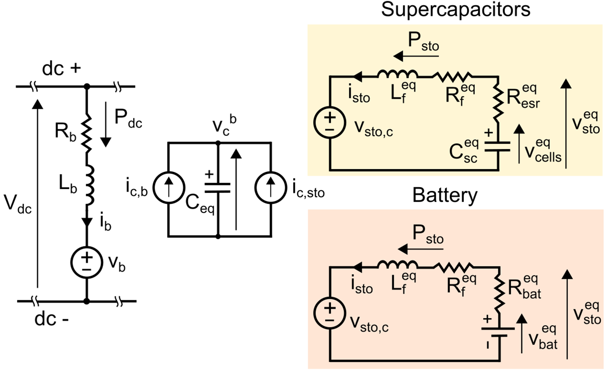

## Context

An energy storage system connected to HVDC terminals has been selected in HVDC-Wise project as an example of potential future equipment to be included in standardized model exchanges. This kind of equipment is currently at low technology readiness level (TRL), but there is an interest to disseminate models to allow system planners to assess benefits of such technologies [[1]](#mdpi). The converter presented in [[2]](#iet) and in [Fig. 1](#fig_converter) has been selected among the candidate technologies listed in section 2.5.2 of [[3]](#d41).

**Figure 1:** Scheme of the DC connected branch of series-connected submodules with energy storage

Modelling this DC-connected energy storage system allowed to highlight some gaps in existing CIM standards [[4]](#isgt) and the possibility of representing the dynamic part by referencing a black box (compiled) model according to the FMI standard [[5]](#fmi). Indeed, as a control has been previously developed in Matlab/Simulink (for EMT simulations), and as it would be time consuming to re-describe the scheme with Modelica equations, it has been decided to test the possibility of representing the dynamic part by referencing a black box (compiled) model according to the FMI standard.

## Model use, assumptions, validity domain and limitations

As shown in [Fig. 1](#fig_converter), the considered converter is made of the series connection of an inductor and several energy storage submodules (ES-SMs). These ES-SMs are half-bridge submodules (as in common AC/DC modular multilevel converters (MMCs)) with an additional dc/dc converter (S3, S4 and Lsm) interfacing the submodule capacitor and the energy storage elements. These energy storage elements can be batteries or supercapacitors. In each ES-SM, switches S1 to S4 are turned on or off to control the power exchange between the energy storage elements and the HVDC terminals and to balance vsmj, the voltages of each submodule capacitor.

For system-level simulations, considering each switch, each capacitor, internal balancing algorithms, etc. brings an unnecessary complexity and an _average arm_ modelling approach can be used as in [Fig. 2](#fig_model). In such a model, the energy stored in all submodule capacitors is modelled with a single equivalent capacitor (Ceq) with an equivalent voltage vcb. The power absorbed by the chain of ESSMs is transferred to the equivalent capacitor (vb ib=vcb ic,b). This is controlled by a modulation index mb, modelling the average state of switches S1 and S2 in all ESSMs, and it can be shown that vb=mb vcb. The energy in the equivalent capacitor Ceq evolves also according to the power exchange with the batteries or supercapacitors, which are also modelled as lumped elements.

**Figure 2:** Average model of the ES-SM branch considering supercapacitors or batteries as storage elements

This model then relies on the hypotheses of balancing of voltages vsmj and identical ES-SMs.
It cannot be used for instance for internal balancing studies or switching losses calculations.
The model has not been designed to represent the behavior in case of DC fault.

The model can be used to assess the impact of energy storage for grid stability and derive specifications for this energy storage device.

## Model description

The static part of the model includes only the elements connected to the DC terminals in [Fig. 2](#fig_model): the equivalent resistance and inductance of the inductor, and the controlled voltage source. The dynamic part defines vb and includes the modelling of the energy storage elements and the energy stored in submodule capacitors.

The control is designed to regulate Pdc, the injected dc power and the energy in the capacitors of the ES-SMs.
Pdc is controlled using switches S3 and S4, which in the average model corresponds to the duty cycle of the equivalent dc/dc converter, Db. The energy in the equivalent capacitor is regulated with S1 and S2, which corresponds to the modulation index, mb. The control scheme is extensively detailed in [[2]](#iet).

The control scheme and the modelling of the ES-SMs have been previously built in the Matlab/Simulink environment. The dynamic part of the model is implemented thanks to the Function Mock-up Unit (FMU) standard [[5]](#fmi). The _fmu_ file then includes the models for the supercapacitors, current control loops, energy on submodule capacitors, etc.

The main parameters of the model are listed in [Tab. 1](#tab_param).

**Table 1:** Parameters of the model

General parameters

| Symbol | Description | Default value | Comment |
| --- | --- | --- | --- |
| Pbranch | Nominal power of the branch of ES-SMs | 200 MW | Impacts most of the values in the model. |
| Vdc | DC voltage (between converter terminals) | 640 kV | Impacts mostly the number of submodules. |
| mmax | Maximum modulation factor in steady state operation | 0.9 | Impacts mostly the number of submodules. |
| VESM | Average voltage of the capacitor in a submodule | 3800 V | Impacts mostly the number of submodules. |
| ηind | Efficiency of the inductor in the ESM branch | 0.995 |  Used to calculate Rb. |
| Imax,switches | Maximum peak current of the switches | 2400 A | Used to calculate Lb. |
| k0 | Ratio between current threshold after which the blocking is triggered and DC nominal branch current| 1.25 | Used to calculate Lb|
| tdelay | Time in between the detecting of the fault and the blocking of the branch | 300 µs | Used to calculate Lb. |
| VESM,sto | Nominal voltage of the storage device in each submodule | 1450 V | Used for batteries as Vbateq. Used for Supercapacitors to calculate minimal and maximal voltage of the pack of supercapacitors and then Csceq. |

Parameters for supercapacitors
| Symbol | Description | Default value | Comment |
| --- | --- | --- | --- |
| W | Usable stored energy (energy deviation between minimal and maximal voltage of the  pack of supercapacitors) | 540 MJ | Used to calculate Csceq |
| ηSC | Efficiency of the pack of supercapacitors | 0.98 | For supercapacitors only. Used to calculate Resreq|
| k1 | Ratio between the maximum voltage of the pack of supercapacitors to absorb Pbranch and the nominal voltage of the pack storage devices | 0.9 | Used to calculate Csceq. |
| k2  | Ratio between the minimum voltage of the pack of supercapacitors to provide Pbranch and the maximum voltage of the pack of supercapacitors | 0.4 | Used to calculate Csceq. |
| k3  | Ratio between VSC,discharge lim and the minimum voltage of the pack of supercapacitors to provide Pbranch | 0.7 | The limitation of the power that can be provided decreases proportionally to the energy storage voltage when VSC,discharge lim is reached. |

Parameter for batteries
| Symbol | Description | Default value | Comment |
| --- | --- | --- | --- |
| Ploss,pu | Losses in pu at maximum current | 0.015 pu | Used to compute Rbateq |

Parameters related to the storage-side converter (S3, S4, Lsm)
| Symbol | Description | Default value | Comment |
| --- | --- | --- | --- |
| RILf | Percentage in pu of the allowed current ripple in the inductance Ldcdc | 0.15 pu | Used for the calculation of Ldcdc. |
| f | Switching frequency for switches S3 and S4. | 2 kHz | Used for the calculation of Ldcdc. |
  
Parameters related to control loops
| Symbol | Description | Default value | Comment |
| --- | --- | --- | --- |
| τV_dc | Time constant of the Vcb control loop | 50 ms | Used to calculate the cut of frequency ωc. |
| ψ | Damping of the Vcb control loop | 0.707 | Used to calculate KpVc and KiVc. |
| τb,Ireg | Time constant of the Ib control loop | 10 ms | Used to calculate KpP and KiP. |
| τb,Isc | Time constant of the Isto control loop | 2 ms | Used to calculate KpIsc and KiIsc. |

Equations to calculate Rb, Lb, NESM (number of ES-SMs), Csceq, Resreq and Rbateq from the parameters in [Tab. 1](#tab_param) are given in [[2]](#iet) and in [[6]](#d42).

## Model exchange

As CIM-based data exchange currently requires concrete modelling of the static part of equipment models, several gaps in canonical CIM are identified.

First, relevant classes and attributes to model electrical circuit of DC energy storage are not available in current editions of the IEC standards. It was then necessary to propose new classes including a class _DCStorage_ which has attributes like rated DC voltage, maximal power, number of submodules, series inductance. The submodules can be of two types (with batteries or supercapacitors) which are also described in proposed extensions with attributes including maximal energy, no-load voltage, capacitance.

The second identified gap is the limited capability of the standard to report DC state variables of DC terminals and nodes, i.e. in general there is a gap to report power flow results of the DC part of the model. Therefore, this gap was also covered by an extension.

The mentioned gaps are covered in the [CIM extension](../../../Data_exchange_specifications/CIM_extensions/HVDC-WISE_Extensions.xml).

Dynamic part of the model is exchanged with the [FMU](../../../Artifacts_&_equations/DC_connected_energy_storage/Branch_ESM_control_FMU.fmu) artifact.

## Open source implementations

This model has been implemented in :

| URL | Language | Open-Source License | Last consulted date | Comments |
| --- | --------- | ------------------- |------------------- | -------- |
| [HVDC-Wise Lib](https://github.com/HVDC-WISE/HVDC-Wise_lib) | CIM/GMES with FMU | [EUPL v1.2](https://github.com/HVDC-WISE/HVDC-Wise_lib/tree/main?tab=EUPL-1.2-1-ov-file)  | XX/09/2024 |  |

## Table of references

<a id="mdpi">[1]</a> Florian Errigo, Joan Sau-Bassols, Hind Bekkouri, Florent Morel, Juan-Carlos Gonzalez-Torres, et al.. Design of a Single Branch of Energy Storage Submodules Connected to HVDC Systems to Support AC Grids. Electronics, 2024, 13 (17), pp.3355. [doi: 10.3390/electronics13173355](https://dx.doi.org/10.3390/electronics13173355)

<a id="iet">[2]</a> Joan Sau-Bassols, Florent Morel, Florian Errigo, Hind Bekkouri, Juan Carlos Gonzalez-Torres, et al.. Single branch of energy storage submodules to integrate energy storage devices in HVDC systems. 19th International Conference on AC and DC Power Transmission (ACDC 2023), Mar 2023, Glasgow, United Kingdom. [doi: 10.1049/icp.2023.1329](https://doi.org/10.1049/icp.2023.1329).

<a id="d41">[3]</a> Sarah Anhaus, Tom Bösterling, Diego Cirio, Agusti Egea-Alvarez, Florian Errigo, Callum Henderson, Damiano Lanzarotto, Geoff Love, Florent Morel, Lars Osterkamp, Joan Sau-Bassols, & Lorenzo Carmine Vitulano. (2023). HVDC-WISE Deliverable 4.1: Identification of key technologies, potential benefits and restrictions. [doi: 10.5281](https://doi.org/10.5281/)

<a id="isgt">[4]</a> Chavdar Ivanov, Georgii Tishenin, Damiano Lanzarotto, Florent Morel, Antonello Monti, Standardized Model Exchange of HVDC Equipment for RMS and EMT Simulations, IEEE ISGT Europe, Oct 2024, Zagreb, Croatia.

<a id="fmi">[5]</a> Modelica Association, Functional mock-up interface, [https://fmi-standard.org/](https://fmi-standard.org/), Retrieved 2024/09/19.

<a id="d42">[6]</a> Ning Yiang et al. (2024). HVDC-WISE Deliverable 4.2: Technology modelling.
