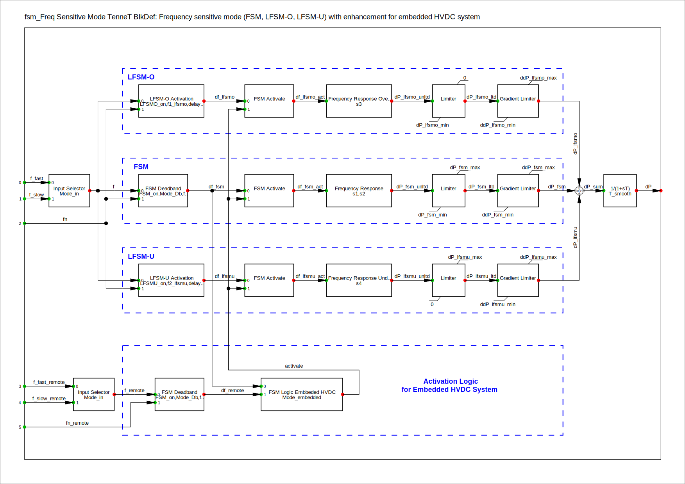

## Context

Frequency sensitive mode (FSM, LFSM-O, LFSM-U) with enhancement for embedded HVDC system.

## Model use, assumptions, validity domain and limitations

The model can be used for transient stability analysis and carrying out fundamental investigations on generic network models, as well as to assess potential network expansions with multi-terminal HVDC systems with regard to the electrical behavior.

**Assumptions and limitations:**

 - Without output smoothing (T_smooth = 0), in some cases of steep power changes with changing slope directions non-convergence problems are possible.
 - The time constant T_smooth should be selected to be comparatively small in order not to adversely affect the behavior over time of the frequency-dependent active power control.
 - In the event that the HVDC system does not connect two synchronous areas with each other, but itself embedded within a synchronous area, the frequency-dependent modes of operation are only active when the frequency at the mutual station is either within the FSM frequency deadband or moving in the opposite direction (i.e. decreases below the nominal frequency while it is above the rated frequency at the local terminals, and vice versa. This is to ensure that the frequency-dependent operating modes can become effective in the event of a grid disconnection, while they do not become active as long as the HVDC system is embedded in an intact grid. 

 
## Model description 

The frequency-dependent active power control supports three operating modes:
 - Frequency sensitive mode (FSM),
 - Limited frequency sensitive mode – overfrequency (LFSM-O),
 - Limited frequency sensitive mode – underfrequency (LFSM-U).

The block diagram of the model is shown in [Figure 1](#fig_fsm):

**Figure 1:** FSM Block Diagram

 
The model consists of the following parameters:

| Parameter      | Unit | Description |
| --------------------------------| ----------------------------------- | ---------------------------------------------------- |
|	activate	|		|	Activation signal for FSM/LFSM of embedded HVDC system	|
|	ddP_fsm_max	|	%/s	|	Max. rate of change of dP FSM (pos.)	|
|	ddP_fsm_min	|	%/s	|	Min. rate of change of dP FSM (neg.)	|
|	ddP_lfsmo_max	|	%/s	|	Max. rate of change of dP LFSM-O	|
|	ddP_lfsmo_min	|	%/s	|	Min. rate of change of dP LFSM-O	|
|	ddP_lfsmu_max	|	%/s	|	Max. rate of change of dP LFSM-U	|
|	ddP_lfsmu_min	|	%/s	|	Min. rate of change of dP LFSM-U	|
|	delay_init_fsm	|	s	|	Initial response delay FSM (deadband)	|
|	delay_init_lfsmo	|	s	|	Initial response delay LFSM-O	|
|	delay_init_lfsmu	|	s	|	Initial response delay LFSM-U	|
|	df_fsm	|	p.u.	|	Frequency deviation relevant for FSM	|
|	df_fsm_act	|	p.u.	|	Frequency deviation relevant for FSM of embedded HVDC system	|
|	df_lfsmo	|	p.u.	|	Frequency deviation relevant for LFSM-O	|
|	df_lfsmo_act	|	p.u.	|	Frequency deviation relevant for LFSM-O of embedded HVDC system	|
|	df_lfsmu	|	p.u.	|	Frequency deviation relevant for LFSM-U	|
|	df_lfsmu_act	|	p.u.	|	Frequency deviation relevant for LFSM-U of embedded HVDC system	|
|	df_remote	|	p.u.	|	Frequency deviation from remote (outside deadband)	|
|	dP	|	p.u.	|	Additonal active power	|
|	dP_fsm	|	p.u.	|	Additional active power by FSM	|
|	dP_fsm_max	|	%	|	Maximum additional power FSM (dP > 0)	|
|	dP_fsm_min	|	%	|	Minimum additional power FSM (dP < 0)	|
|	dP_fsm_unltd	|	p.u.	|	Unlimited additional active power by FSM	|
|	dP_lfsmo	|	p.u.	|	Additional active power by LFSM-O	|
|	dP_lfsmo_min	|	%	|	Max. power reduction LFSM-O (dP < 0)	|
|	dP_lfsmo_unltd	|	p.u.	|	Unlimited additional active power by LFSM-O	|
|	dP_lfsmu	|	p.u.	|	Additional active power by LFSM-U	|
|	dP_lfsmu_max	|	%	|	Max. additional power LFSM-U (dP > 0)	|
|	dP_lfsmu_unltd	|	p.u.	|	Unlimited additional active power by LFSM-U	|
|	f	|	Hz	|	Frequency input signal	|
|	f_db1	|	mHz	|	Lower frequency deadband FSM (neg. value)	|
|	f_db2	|	mHz	|	Upper frequency deadband FSM (pos. value)	|
|	f_fast	|	Hz	|	Fast frequency input signal	|
|	f_fast_remote	|	Hz	|	Fast frequency input signal from remote	|
|	f_over_fsm	|		|	Flag over-frequency FSM (frequency above deadband)	|
|	f_over_lfsmo	|		|	Flag over-frequency LFSM-O	|
|	f_remote	|	Hz	|	Frequency input signal from remote	|
|	f_slow	|	Hz	|	Slow frequency input signal	|
|	f_slow_remote	|	Hz	|	Slow frequency input signal from remote	|
|	f_under_fsm	|		|	Flag under-frequency FSM (frequency below deadband)	|
|	f_under_lfsmu	|		|	Flag under-frequency LFSM-U	|
|	f1_lfsmo	|	Hz	|	Frequency threshold for LFSM-O (> fn)	|
|	f2_lfsmu	|	Hz	|	Frequency threshold for LFSM-U (< fn)	|
|	fn	|	Hz	|	Nominal frequency	|
|	fn_remote	|	Hz	|	Nominal frequency of remote system	|
|	FSM_on	|		|	Frequency Sensitive Mode (FSM): 0 = off, 1 = on	|
|	LFSMO_on	|		|	Limited FSM-O (overfrequency): 0=off, 1=on	|
|	LFSMU_on	|		|	Limited FSM-U (underfrequency): 0=off, 1=on	|
|	Mode_Db	|		|	Frequency deadband FSM: 0 = without, 1 = with	|
|	Mode_embedded	|		|	: 0 = inter-system, 1 = embedded HVDC	|
|	Mode_in	|		|	Input: 0 = slow (precise), 1 = fast f signal	|
|	s1	|	%	|	Droop 1 (FSM upward regulation, for f < fn)	|
|	s2	|	%	|	Droop 2 (FSM downward regulation, for f > fn)	|
|	s3	|	%	|	Droop 3 (LFSM-O downward regulation, for f > f1)	|
|	s4	|	%	|	Droop 4 (LFSM-U upward regulation, for f < f2)	|
|	T_smooth	|	s	|	Output smoothing time constant (PT1 filter)	|

The three operating modes can be set individually and independently of each other via the parameters FSM_on, LFSMO_on or LFSMU_on.
The Mode_in parameter will set the input signal either as slow (filtered with a longer time constant) or as fast (filtered with a shorter time constant) according to the frequency signal value of the signal processing block "Signal Calculation".

The frequency dependent mode FSM supports a frequency deadband around the nominal frequency, which is activated with the parameter Mode_Db and set via the parameters f_db1 (deadband below nominal frequency) and f_db2 (deadband above nominal frequency). 
If the frequency is outside the deadband, a time delay delay_init_fsm can be set, after which the controller responds. If no deadband is used, the regulation works continuously (without response delay). The statics can be set separately for the frequency range below the nominal frequency (increase in active power, droop s1) and above the nominal frequency (reduction in active power, droop s2) . The maximum and minimum (max. negative) additional power can be specified via the parameters dP_fsm_max and dP_fsm_min.
The time gradient of the output signal (the speed at which the output signal changes) is limited with the parameters ddP_fsm_max and ddP_fsm_min.

The limited frequency dependent overfrequency mode LFSM-O reacts when the frequency is greater thanf1_lfsmo, with an initial time delay of delay_init_lfsmo. The droop can be set via parameter s3. The maximum power reduction (i.e. the minimum additional negative power) is specified via the dP_fsmo_min parameter. The temporal gradient of output signal (the rate at which the output signal changes) is set with the parameters ddP_lfsmo_max and ddP_lfsmo_min , where ddP_lfsmo_min must be less than zero.

The limited frequency dependent underfrequency mode LFSM-U reacts when the frequency is lower than f2_lfsmu with an initial time delay of delay_init_lfsmu. The droop can be set via parameter s4. The maximum power increase (i.e. the maximum additional power) is specified via dP_fsmu_max. The time gradient of the output signal (the speed at which the output signal changes) is set with the parameters ddP_lfsmu_max and ddP_lfsmu_min.

The output signal is filtered through a first-order low-pass filter with the time constant T_smooth. This output filtering results in a better performance of the entire control model of the HVDC system in individual test cases. 

The Mode_embedded parameter is used to designate if the HVDC system connects two synchronous areas with each other or is in an embedded HVDC system. Which HVDC station serves as the remote end depends on which signal conditioning block is linked in the "Remote Signal Calculation" slot.

## Model exchange

The dynamic model is serialized in [CIM xml file](https://supergridinstitute.sharepoint.com/:f:/r/sites/HVDC-WISE/Documents%20partages/WP4%20-%20Enabling%20technologies/D4.3/HVDC-Wise_lib_internal/Artifacts_%26_equations/HVDC_MMC/DMC_FSM.xml) using DetailedModelConfigurationProfile of IEC 61970-457:2024 ([[1]](#1)), as well as Modelica code.
The CIM model includes classes needed to exchange the dynamic model configuration, i.e. the structure and connectivity of a detailed model, whereas the Modelica model includes equations which explicitly describe the model dynamics.

## Table of references & license

<a id="1">[1]</a>  International Electrotechnical Commission TC 57, “[Energy management system application program interface (EMS-API) - Part 457: Dynamics profile](https://webstore.iec.ch/en/publication/68910),” IEC, 2024.
