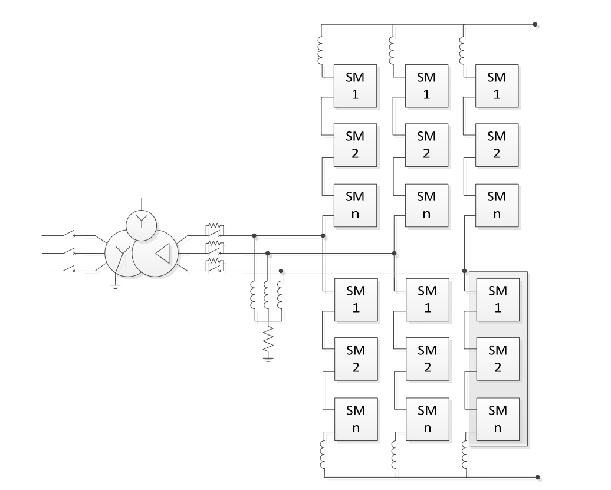
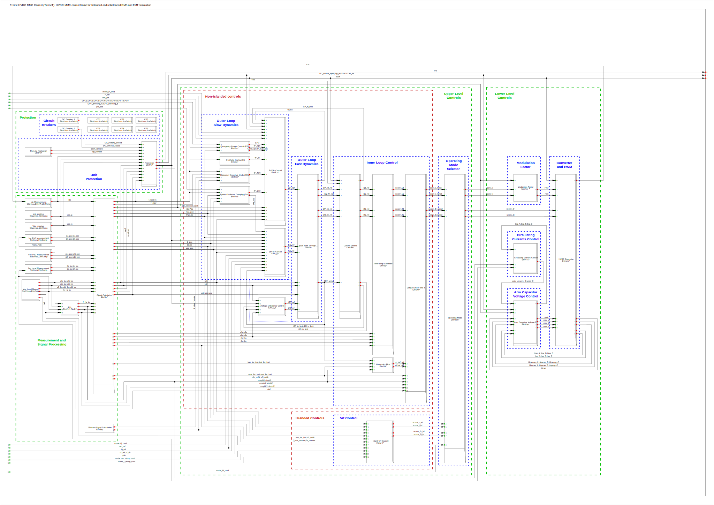
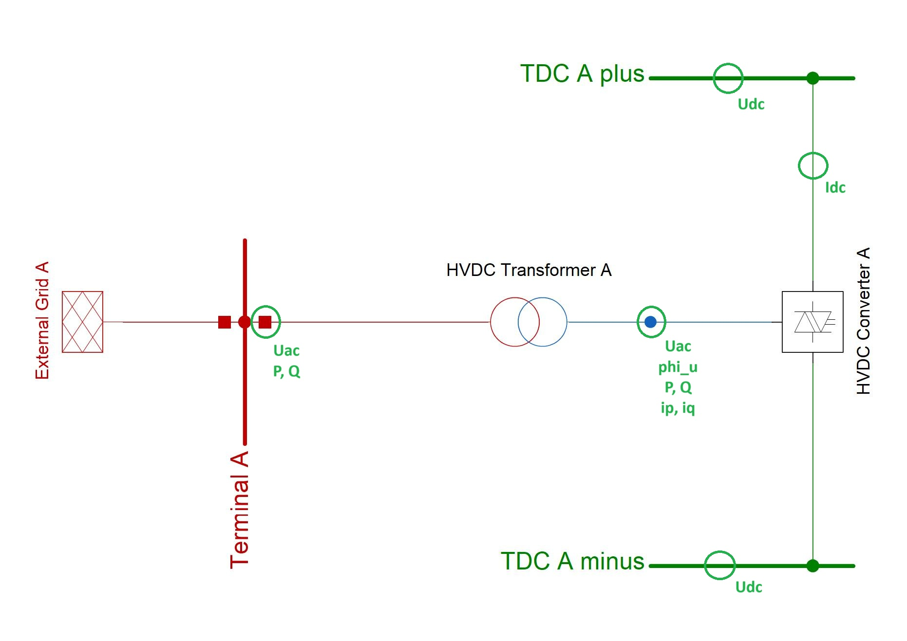

## Context

Generic models of multi-terminal HVDC systems, using modular modular multi-level converters for the symmetrical and asymmetrical RMS and EMT simulation, have been implemented in [PowerFactory](https://www.digsilent.de/en/powerfactory.html) by DigSILENT GmbH for TenneT TSO GmbH.

## Model use, assumptions, validity domain and limitations

The model can be used for transient stability analysis and carrying out fundamental investigations on generic network models, as well as to assess potential network expansions with multi-terminal HVDC systems with regard to the electrical behavior.

**Assumptions and limitations:**

 - To emulate the power converter (converter), the PowerFactory internal element "PWM Converter" is used. The HVDC converter technology considered in the model is modular multi-level Converter (MMC). The models can be used for both MMC in half-bridge and full-bridge technologies.
 - The converter models for load flow calculation, RMS-simulation and the Controlled voltage source model for EMT-simulations are based on a fundamental frequency approach.
 - The PWM converter losses are specified in the fundamental frequency models as the sum of:
 	- No-load losses: specified with the parameter Pnold in [kW].
	- Switching losses: specified with the parameter swtLossF actor in [kW/A].
	- Resistive losses: specified with the parameter resLossF actor in [Ohm].
 - The measurements at the neutral points of the DC network must be based on the same reference voltage as the measurements at the positive and negative terminals.

## Model description 

**Electrical circuit**

The model's electrical circuit includes the following components:
 - HVDC converter.
 	- The MMC model is based on the topology shown in [Figure 1](#fig_mmc_topology). The model allows selection of half-bridge cell or full-bridge cell for the sub-modules (SM).
 - HVDC transformer.
 	- Connect the DC grid to the high-voltage AC transmission grid.
 - DC chopper.
 	- DC choppers (braking resistors) can be added in the converter stations (at least one per system) to limit the voltage in the event of an overvoltage in the DC system. The DC chopper is modeled separately and independently from the AC/DC converter. Two models are available:
		- Highly simplified model. Consisting of one or two DC voltage sources and one or two diodes.
		- Detailed model. Consisting of one or two controlled resistors, one or two actively switched power electronic valves and the controller.
 - DC nodes or DC busbars.
 - DC lines/cables.
 - Choke coils.
 	- Placed at the ends of the DC lines/cables to influence the current/voltage gradients.
 - DC circuit breakers.
 	- Placed on the DC terminals of the AC/DC converters or the ends of the lines/cables in the DC grid.

**Figure 1:** Modular multilevel converter topology ([[1]](#1))

 
 **Control system**

This model contains a collection of dynamic models which simulate the control and protection functions of HVDC systems and converter stations in the RMS and EMT domains. 
The initialization of dynamic models is done automatically based on the solution of the load flow calculation and with the help of initialization equations additionally stored in the dynamic models.
The interconnection of the dynamic control models is given in [Figure 2](#fig_mmc_control), where each slot represents a different control system.

**Figure 2:** HVDC control system diagram

The measuring points for the input signals of the control and protection functions of the converter station are marked in [Figure 3](#fig_mmc_measuring). The selection of used measurements depends on the type of HVDC system (onshore / offshore) and the selected parameterization.

**Figure 3:** Measuring points for the input signals of the control and protection functions of a converter station

 **Interface**

Transformation of signals from the stationary coordinate system (*abc* reference frame - alpha beta components) into rotating coordinate system (*dq* reference frame - dq components) is done with Clarke-Park transformation inside the Signal Calculation block.
The inverse signal transformation (from the rotating coordinate system into the stationary coordinate system) is done by inverse Park transformation inside the Output Limiter and Transformation block.

## Model exchange

The static parts of the MMC model that are listed in the previous section, can be mapped to various subclasses of the *DCConductingEquipment* class in CIM, e.g. HVDC converter to *ACDCConverter* class, HVDC transformer to *PowerTransformer*, DC chopper to *DCChopper*, DC nodes or DC busbars to *DCNode* and *DCTerminal*, DC lines/cables to *DCLineSegment*, Choke coils to *DCSeriesDevice*, and DC circuit breakers to subclasses of *DCSwitch*, respectively. None of the abovementioned classes required extensions to CIM due to the static part being adequately covered in the latest CIM version.

The dynamic model is serialized in CIM xml files using DetailedModelConfigurationProfile of IEC 61970-457:2024 ([[2]](#2)), as well as Modelica code. The CIM model includes classes needed to exchange the dynamic model configuration, i.e. the structure and connectivity of a detailed model, whereas the Modelica model includes equations which explicitly describe the model dynamics. The CIM HVDC MMC control model consists of the following blocks:

| Block      | Dynamic Model Name | Description |
| --------------------------------| ----------------------------------- | ---------------------------------------------------- |
|	HVDC Converter	|	---	|	HVDC converter (primary technology)	|
|	[Operating Mode](https://supergridinstitute.sharepoint.com/:f:/r/sites/HVDC-WISE/Documents%20partages/WP4%20-%20Enabling%20technologies/D4.3/HVDC-Wise_lib_internal/Artifacts_%26_equations/HVDC_MMC/DMC_OM.xml)	|	opm_Operating Mode 	|	Selection for using the control output signals for mains parallel operation or isolated operation	|
|	[Island V/f Control](https://supergridinstitute.sharepoint.com/:f:/r/sites/HVDC-WISE/Documents%20partages/WP4%20-%20Enabling%20technologies/D4.3/HVDC-Wise_lib_internal/Artifacts_%26_equations/HVDC_MMC/DMC_IVF.xml)	|	V_f Control 	|	Regulation of voltage level and frequency	|
|	[P/Vdc Control](https://supergridinstitute.sharepoint.com/:f:/r/sites/HVDC-WISE/Documents%20partages/WP4%20-%20Enabling%20technologies/D4.3/HVDC-Wise_lib_internal/Artifacts_%26_equations/HVDC_MMC/DMC_PVdcC.xml)	|	P_Vdc Control 	|	Control of active power (on the AC or DC side) or voltage on the DC side	|
|	[Q/Vac Control](https://supergridinstitute.sharepoint.com/:f:/r/sites/HVDC-WISE/Documents%20partages/WP4%20-%20Enabling%20technologies/D4.3/HVDC-Wise_lib_internal/Artifacts_%26_equations/HVDC_MMC/DMC_QVacC.xml)	|	Q_Vac Control Flexible Output 	|	Reactive power control (on the AC side) or voltage magnitude on the AC side	|
|	[Emergency Power Control (EPC)](https://supergridinstitute.sharepoint.com/:f:/r/sites/HVDC-WISE/Documents%20partages/WP4%20-%20Enabling%20technologies/D4.3/HVDC-Wise_lib_internal/Artifacts_%26_equations/HVDC_MMC/DMC_EPC.xml)	|	EPC TenneT 	|	Emergency Power Control (EPC) according to TenneT specification	|
|	[Frequency Sensitive Mode (FSM)](https://supergridinstitute.sharepoint.com/:f:/r/sites/HVDC-WISE/Documents%20partages/WP4%20-%20Enabling%20technologies/D4.3/HVDC-Wise_lib_internal/Artifacts_%26_equations/HVDC_MMC/DMC_FSM.xml)	|	fsm_Freq Sensitive Mode TenneT 	|	Generates setpoint changes of the active power in frequency dependency	|
|	[Power Oscillation Damping (POD)](https://supergridinstitute.sharepoint.com/:f:/r/sites/HVDC-WISE/Documents%20partages/WP4%20-%20Enabling%20technologies/D4.3/HVDC-Wise_lib_internal/Artifacts_%26_equations/HVDC_MMC/DMC_POD.xml)	|	pod_Power Oscillation Damping 	|	Generates setpoint changes of the active or reactive power depending on an input variable (configurable)	|
|	[Synthetic Inertia (SI)](https://supergridinstitute.sharepoint.com/:f:/r/sites/HVDC-WISE/Documents%20partages/WP4%20-%20Enabling%20technologies/D4.3/HVDC-Wise_lib_internal/Artifacts_%26_equations/HVDC_MMC/DMC_SI.xml)	|	si_Synthetic Inertia 	|	Generates setpoint changes of the active power depending on the frequency (or the frequency derivative) with the aim of emulating mechanical inertia	|
|	[Voltage Unbalance Control](https://supergridinstitute.sharepoint.com/:f:/r/sites/HVDC-WISE/Documents%20partages/WP4%20-%20Enabling%20technologies/D4.3/HVDC-Wise_lib_internal/Artifacts_%26_equations/HVDC_MMC/DMC_VU.xml)	|	u2_Voltage Unbalance Control 	|	Regulation to reduce voltage asymmetries (negative sequence voltage) in normal operation	|
|	[Harmonics Filter](https://supergridinstitute.sharepoint.com/:f:/r/sites/HVDC-WISE/Documents%20partages/WP4%20-%20Enabling%20technologies/D4.3/HVDC-Wise_lib_internal/Artifacts_%26_equations/HVDC_MMC/DMC_HF.xml)	|	haf_Active Harmonics Filter 	|	Active harmonic filter	|
|	[Fault Ride Through (FRT)](https://supergridinstitute.sharepoint.com/:f:/r/sites/HVDC-WISE/Documents%20partages/WP4%20-%20Enabling%20technologies/D4.3/HVDC-Wise_lib_internal/Artifacts_%26_equations/HVDC_MMC/DMC_FRT.xml)	|	FRT Control or Continuous Vac Ctrl	|	Dynamic support: additional reactive current depending on the over- or undervoltage or continuous voltage regulation with proportional controller (fast outer control loop)	|
|	[Current Limiter](https://supergridinstitute.sharepoint.com/:f:/r/sites/HVDC-WISE/Documents%20partages/WP4%20-%20Enabling%20technologies/D4.3/HVDC-Wise_lib_internal/Artifacts_%26_equations/HVDC_MMC/DMC_CL.xml)	|	Limiter Current 	|	Current limitation for mains parallel operation	|
|	[Inner Loop Controller](https://supergridinstitute.sharepoint.com/:f:/r/sites/HVDC-WISE/Documents%20partages/WP4%20-%20Enabling%20technologies/D4.3/HVDC-Wise_lib_internal/Artifacts_%26_equations/HVDC_MMC/DMC_ILC.xml)	|	idq_Current Control 	|	Internal control for mains parallel operation (usually current control, alternatively voltage regulation)	|
|	[Output Limiter and Transformation](https://supergridinstitute.sharepoint.com/:f:/r/sites/HVDC-WISE/Documents%20partages/WP4%20-%20Enabling%20technologies/D4.3/HVDC-Wise_lib_internal/Artifacts_%26_equations/HVDC_MMC/DMC_OLT.xml)	|	Output Limiter Transform 	|	Output voltage limitation and inverse transformation of the signals	|
|	Modulation Factor	|	pm_Modulation Factor 	|	Conversion of the voltage output signal of the controller into the modulation factor (considering the HB-MMC or FB-MMC technology)	|
|	Arm Capacitor Voltage Control	|	cap_MMC Capacitor Control 	|	Regulation of the voltage of the arm capacitors (considering the aggregate arm model or simplified controller structure)	|
|	Circulating Current Control	|	ccc_Circulating Current Control 	|	Regulation for suppressing circulating currents in the MMC	|
|	Signal Calculation	|	Signal Calculation 	|	Processing of the measured variables (coordinate transformation, filtering) and calculation of the input signals for the control	|
|	PLL	|	PLL DDSRF Nested Neg. Seq. PLL 	|	Phase-Locked Loop (PLL) for synchronization to the voltage angle and frequency measurement	|
|	Remote Signal Calculation	|	Signal Calculation 	|	Preparation of the measured quantities and calculation of the input signals for the control of the remote end of the HVDC system	|
|	Protection	|	Protection ACDC 	|	Self-protection and decoupling protection of the HVDC converter or HVDC system	|
|	Remote Protection	|	Protection ACDC 	|	Self-protection and decoupling protection of the HVDC converter at the remote end of the HVDC system	|

Additionally, the HVDC MMC contains the following frames for measurement of signals:

| Frame      | Dynamic Model Name | Description |
| --------------------------------| ----------------------------------- | ---------------------------------------------------- |
|	Vdc positive	|	Frame Voltage Measurement DC 	|	Measurement of the positive DC voltage	|
|	Vdc negative	|	Frame Voltage Measurement DC 	|	Measurement of the negative DC voltage	|
|	Idc Measurement	|	Filter idc 	|	Measurement of the DC current	|
|	Vac Local Measurement	|	Frame Voltage Measurement AC	|	Measurement of the AC voltage at the local AC terminal of the HVDC converter	|
|	Iac Local Measurement	|	Frame Current Measurement AC	|	Measurement of the AC current at the local AC terminal of the HVDC converter	|
|	Vac PoC Measurement	|	Frame Voltage Measurement AC	|	Measurement of the AC voltage at the grid connection point of the HVDC converter	|
|	Iac PoC Measurement	|	Frame Current Measurement AC	|	Measurement of the AC current at the grid connection point of the HVDC converter	|

**Note:** *Currently, the dynamic model is not yet publicly available. HVDC-Wise project partners plan releasing this model after confirmation from the legal services.* 

## Table of references & license
<a id="1">[1]</a> CIGRE Working Group B4.57, "CIGRE Brochure 269: Guide for the Development of Models for HVDC Converters in a HVDC Grid," CIGRE, Paris, 2014.
 
<a id="2">[2]</a>  International Electrotechnical Commission TC 57, “[Energy management system application program interface (EMS-API) - Part 457: Dynamics profile](https://webstore.iec.ch/en/publication/68910),” IEC, 2024.
