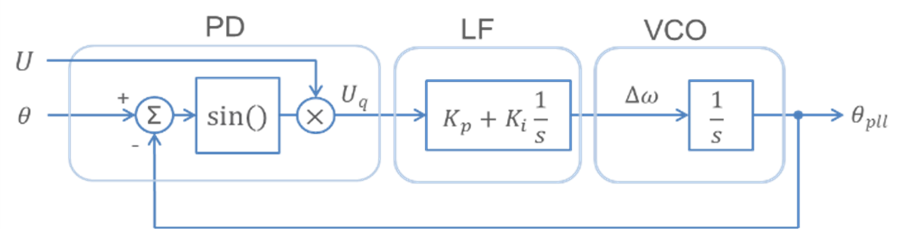
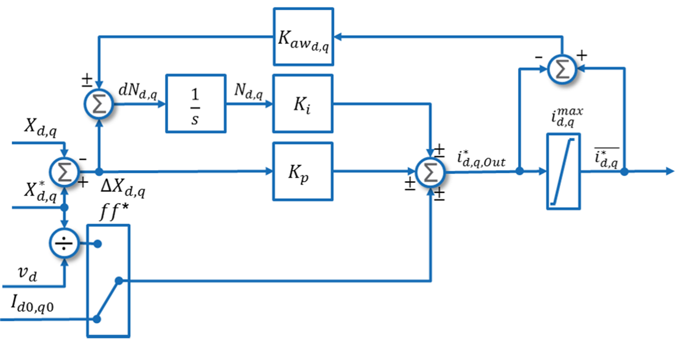
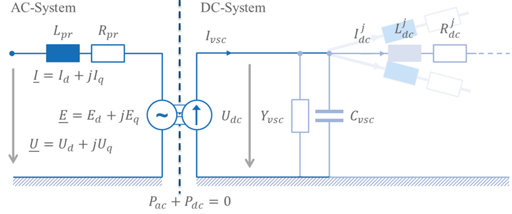

## Context
The model was created to analyze the impact of VSC-HVDC transmission systems on various power system stability aspects such as voltage and rotor angle stability. As part of this goal a main aspect was to derive a generic vendor independent VSC-HVDC model that could be used in the early stages of the network planning process where only limited information about the exact configurations is given.[[1]](#1)

## Model use, assumptions, validity domain and limitations

The model is part of an average value system model (RMS) and is therefore based on the same assumptions that RMS-modelling entails. Thus, it has a very limited frequency range centered around 50 Hz. The high frequency aspects of the VSC are neglected. Furthermore, the DC quantities, due to their fast dynamics, are seen as instantaneous values within the model. Through the linkage of the AC side voltage to the DC side the model is independent of the actual converter topology (multilevel, cascaded…) and the DC. network topology (monopole/bipole). In addition, by neglecting conversion losses and filters the model is further generalized. The main purpose of the model is therefore not to depict functionalities of the VSC into detail but focus more on the VSC in the context of grid analysis of large grid excerpts. It can be used within the network planning process where several grid expansion states need to be analyzed for different stability aspects. Where the grid excerpt of interest is large and the focus is mainly on large signal disturbances as for example system splits. It is not necessarily suitable for detailed analysis of fast converter dynamics or interaction between converters.[[1]](#1)

## Model description

The complete VSC model includes in addition to the VSC core part an outer- and inner control model as well as a PLL component. The equations and implementations are stated in the following sub-sections. At the end of each sub-section a table with the parameter and variable definitions is given. About the notation in general: a lowercase letter indicates that the value of the variable is given in p.u. and a “*” indicates reference values. A “ $\bar{}$ ” indicates that it is a limited variable. Complex variables are indicated by a “_” The initialization values of the state variables are given when the variable is first mentioned for all other variables the initial values can be derived from the initial load flow. The calculations take place in the p.u. system.

### PLL

PLL block diagram is shown in [Figure 1](#fig_PLL_block_diagram). 

**Figure 1:** PLL block diagram

Inputs, outputs, parameters, state variables and equations are presented below.

**Input:** 

$U$, $\theta$, $\theta_{\text{pll}}$, $x_{\text{pll}}$

**Output:** 

$U_{d}$, $U_{q}$, $\theta_{\text{pll}}$

**Parameters:** 

$K_i$, $K_p$

**State Variables:** 

$\theta_{\text{pll}}$, $x_{\text{pll}}$ with $\theta_{\text{pll},0} = \theta_{\text{SS}}$ and $x_{\text{pll},0} = 0$

**Equations:** 

$U_d = U \cdot \cos(\theta - \theta_{\text{pll}})$

$U_q = U \cdot \sin(\theta - \theta_{\text{pll}})$

$\Delta\omega_{\text{PLL}} = K_p \cdot U_q + K_i \cdot x_{\text{PLL}}$

$\frac{d\theta_{\text{pll}}}{dt} = \Delta\omega_{\text{PLL}}$

PLL parameters and variables are described in [Table 1](#tab_PLL_parameters). 

**Table 1:** PLL parameters and variables description

| Parameters                         | Description                             |
|-----------------------------------|-----------------------------------------|
| $K_i$                             | PLL loop filter integral gain           |
| $K_p$                             | PLL loop filter proportional gain       |
| **Algebraic Variables**           |**Description**                          |
| $U$                               | AC bus voltage magnitude                |
| $\theta$                          | AC bus voltage angle                    |
| $U_d$                             | AC bus voltage d component              |
| $U_q$                             | AC bus voltage q component              |
| $\Delta\omega_{\text{PLL}}$       | PLL speed change                        |
| **State Variables**               |**Description**                          |
| $\theta_{\text{pll}}$             | PLL angle                               |
| $x_{\text{PLL}}$                  | PLL loop filter integrator              |

### Outer control

Depending on which variables should be controlled ($X_d$ and $X_q$) there are 4 operation modes. The modes only differ in their input variables. Inputs, outputs, parameters, state variables, and equations are presented below.

**Input:** 
- $P^* $, $P$, $U_{ac}^* $, $U_{ac}$ (Active power control and AC voltage regulation)
- $U_{dc}^* $, $U_{dc}$, $U_{ac}^* $, $U_{ac}$ (DC and AC voltage regulation)
- $P^* $, $P$, $Q^* $, $Q$ (Active and reactive power control)
- $U_{dc}^* $, $U_{dc}$, $Q^* $, $Q$ (DC voltage regulation and reactive power control)

**Output:**
- $I_{d,Out}^* $, $I_{q,Out}^* $

**Parameters:**
- $K_{i,d}, K_{i,q}, K_{p,d}, K_{p,q}, K_{awd}, K_{awq}$

**State Variables:** 
- $N_d, N_q$ with $N_d=0$ and $N_q=0$

**Equations:**

$I_{d,Out}^* = K_{p,d} \cdot (X_d^* - X_d) + K_{i,d} \cdot N_d + I$

$N_d = \int dN_d$

$dN_d = (X_d^* - X_d) + K_{awd} \cdot (I_{d,Out}^* - I_d^*)$

$I_{q,Out}^* = K_{p,q} \cdot (X_q^* - X_q) + K_{i,q} \cdot N_q + I$

$N_q = \int dN_q$

$dN_q = (X_q^* - X_q) + K_{awq} \cdot (i_{q,Out}^* - i_q^*)$

### Current limiter

Outer control loop with current limiter is shown in [Figure 2](#fig_outer_control). 

**Figure 2:** Outer control loop with current limiter

Inputs, outputs, parameters, state variables, and equations are presented below.

**Input:** 
- $I_{d,Out}^\ast, I_{q,Out}^\ast$

**Output:** 
- $\bar{I}_d^{\ast}, \bar{I}_q^\ast$

**Parameters:** 
- $I_{max,d}, I_{max,q}$

**Equations:**

$-I_{max,d} \le I_d^{\ast} \le I_{max,d}$

$-I_{max,q} \le I_q^{\ast} \le I_{max,q}$

### Inner control
Inputs, outputs, parameters, state variables, and equations are presented below.

**Input:** 
- $U_d, U_q, I_d, I_q, E_{d0}, E_{q0}$

**Output:** 
- $E_d^* $, $E_q^* $

**Parameters:** 
- $K_{p,d}, K_{p,q}, K_{i,d}, K_{i,q}, X_{pr}$

**State Variables:** 
- $M_d, M_q$ with $M_{d,0}=0, M_{q,0}=0$

**Equations:**

$\dot{M}_d = \Delta I_d = I_d^* - I_d$

$\dot{M}_q = \Delta I_q = I_q^* - I_q$

$M_d = \int \dot{M}_d$

$M_q = \int \dot{M}_q$

$E_d^* = K_{p,d} \cdot \Delta I_d + K_{i,d} \cdot M_d + E_{d0} - I_q \cdot X_{pr} + U_d$

$E_q^* = K_{p,q} \cdot \Delta I_q + K_{i,q} \cdot M_q + E_{q0} + I_d \cdot X_{pr} + U_q$

Outer control and limiter parameters and variables are described in [Table 2](#tab_outer_control_parameters). 

**Table 2:** Outer control and current limiter parameters and variables description
| Parameters       | Description                                           |
|------------------|-------------------------------------------------------|
| $K_{i,Xd}$       | Integral gain of PI Controller for d component       |
| $K_{i,Xq}$       | Integral gain of PI Controller for q component       |
| $K_{p,Xd}$       | Proportional gain of PI Controller for d component    |
| $K_{p,Xq}$       | Proportional gain of PI Controller for q component    |
| $K_{awd}$        | Anti windup coefficient for d component               |
| $K_{awq}$        | Anti windup coefficient for q component               |
| $I_{max,d}$      | Maximum d component current reference                |
| $I_{max,q}$      | Maximum q component current reference                |
| **Algebraic Variables** | **Description**                                         |
| $N_d$               | Integrator in d axis controller                     |
| $N_q$               | Integrator in q axis controller                     |
| $P^*$               | Active power reference                              |
| $Q^*$               | Reactive power reference                            |
| $U_{ac}^*$          | DC voltage reference                                |
| $U_{dc}^*$          | AC voltage reference                                |
| $I_{d,Out}^*$       | d component current reference (unlimited)           |
| $I_{q,Out}^*$       | q component current reference (unlimited)           |
| $\bar{I}_d^*$       | d component current reference (limited)             |
| $\bar{I}_q^*$       | q component current reference (limited)             |
| $dN_d$              | Integral control deviation d axis                   |
| $dN_q$              | Integral control deviation q axis                   |
| **State Variables** | **Description**                                 |
| $N_d$           | Integrator in d axis controller             |
| $N_q$           | Integrator in q axis controller             |

### Limiter

Inputs, outputs, parameters, state variables, and equations are presented below.

**Input:** 
- $U_{dc}, E_d^* , E_q^* $

**Output:** 
- $\bar{E}_d^* , \bar{E}_q^* $

**Parameters:** 
- $M_{max}$

**Equations:** 

$\underline{E}^* = E_d^* + j \cdot E_q^* $

$\bar{E}d^* = E_d^* \cdot \frac{\max(\left|\underline{E}^* \right|, M_{\text{max}} \cdot U_{dc})}{\left|\underline{E}^* \right|}$

$\bar{E}q^* = E_q^* \cdot \frac{\max(\left|\underline{E}^* \right|, M_{\text{max}} \cdot U_{dc})}{\left|\underline{E}^* \right|}$

Inner control and limiter parameters and variables are described in [Table 3](#tab_inner_control_parameters). 

**Table 3:** Inner control and limiter parameters and variables description

| Parameters      | Description                                              |
|-----------------|----------------------------------------------------------|
| $K_{i,d}, K_{i,q}$ | Integral gain for the PI Controller d/q-component     |
| $K_{p,d}, K_{p,q}$ | Proportional gain for the PI Controller d/q-component |
| $X_{pr}$          | Phase reactance                                        |
| $M_{max}$         | Maximum modulation index                               |
| **Algebraic Variables** | **Description**                                  |
| $E_{d0}$            | Steady State voltage drop d component                |
| $E_{q0}$            | Steady State voltage drop q component                |
| $E_d^*$             | d component valve voltage reference (unlimited)      |
| $E_q^*$             | q component valve voltage reference (unlimited)      |
| $U_{dc}$            | DC voltage                                           |
| $\bar{E}_d^*$       | d component valve voltage reference (limited)        |
| $\bar{E}_q^*$       | q component valve voltage reference (limited)        |
| **State Variables** | **Description**                                      |
| $M_d$           | Integrator in the PI Controller                          |
| $M_q$           | Integrator in the PI Controller                          |

### Simplified valve control
Inputs, outputs, parameters, state variables, and equations are presented below.

**Input:** 
- $U_{dc}, E_d^* , E_q^* $

**Output:** 
- $E_q, E_d$

**Parameters:** 
- $T_a, k_{Udc}, R_{pr}, X_{pr}$

**State Variables:** 
- $E_d, E_q$ with $E_{d,0}=R_{pr} \cdot I_{d,0} - X_{pr} \cdot I_{q,0} + U_0 - U_{dc,0} \cdot k_{Udc}$
- $E_{q,0}=R_{pr} \cdot I_{q,0} + X_{pr} \cdot I_{d,0} + 0 - U_{dc,0} \cdot k_{Udc}$

**Equations:**

- $\frac{dE_d }{dt} = \frac{1}{T_a } \cdot ( \bar{E}d^* - (E_d + U_{dc} \cdot k_{Udc}))$

- $\frac{dE_q}{dt} = \frac{1}{T_a} \cdot (\bar{E}q^* - (E_q + U_{dc} \cdot k_{Udc}))$

### VSC model
VSC model is shown in [Figure 3](#fig_vsc_model). 

**Figure 3:** VSC model

Inputs, outputs, parameters, state variables, and equations are presented below.

**Input:** 
- $E_d, E_q, U_d , U_q ,\theta_{\text{pll}} , U_{dc}$

**Output:** 
- $I_r, I_i, I_{VSC}$

**Parameters:** 
- $R_{pr}, X_{pr}, k_{Udc}$

**State Variables:** 
- $E_d, Eq, \theta_{\text{pll}}^ , I_q, I_d$ with $I_r= \text{Re} \left( \frac{P_0}{U_0} \right)$ and $I_i=-\text{Im} \left( \frac{Q_0}{U_0} \right)$

**Equations:**

$L_{pr} \cdot \frac{di_d}{dt} = -R_{pr} \cdot I_d + X_{pr} \cdot I_q + E_d + U_{dc} \cdot k_{Udc} - U_d$

$L_{pr} \cdot \frac{di_q}{dt} = -R_{pr} \cdot I_q + X_{pr} \cdot I_d + E_q + U_{dc} \cdot k_{Udc} - U_q$

$P_{ac} = U_d \cdot I_d + U_q \cdot I_q$

$P_{dc} = -\left(E_d \cdot I_d + E_q \cdot I_q\right) \cdot k_{Udc} \cdot U_{dc}$

$I_{vsc} = \frac{P_{dc}}{U_{dc}}$

$I_r = \cos\left(\theta_{\text{pll}}\right) \cdot I_d - \sin\left(\theta_{\text{pll}}\right) \cdot I_q$

$I_i = \sin\left(\theta_{\text{pll}}\right) \cdot I_d + \cos\left(\theta_{\text{pll}}\right) \cdot I_q$

VSC model parameters and variables are described in [Table 4](#tab_vsc_model_parameters). 

**Table 4:** VSC model parameters and variables description
| Parameter   | Description                               |
|-------------|-------------------------------------------|
| $k_{Udc}$   | DC voltage dependency on U                |
| $X_{pr}$    | Phase reactance                           |
| $R_{pr}$    | Phase resistance                          |
| **Algebraic Variables** | **Description**                             |
| $I_r$               | Real current fed into AC system         |
| $I_i$               | Imaginary current fed into AC system    |
| $I_{VSC}$           | Current injected into DC system         |
| $U_{dc}$            | DC voltage                              |
| $U_d$               | AC bus voltage d component              |
| $U_q$               | AC bus voltage q component              |
| **State Variables** | **Description**                                 |
| $E_d$           | d component modulated valve voltage        |
| $E_q$           | q component modulated valve voltage        |
| $I_d$           | d component current through AC phase reactor|
| $I_q$           | q component current through AC phase reactor|
| $\theta_{\text{pll}}$ | PLL angle                             |

## Model exchange
### Static part
Static part of the voltage source converter model includes the electrical circuit, that can be mapped to existing `Equipment` classes in canonical CIM without a need for extension.

### Dynamic part
Dynamic part of the voltage source converter model includes the control system, the equations are provided in [MATLAB code](../../../Artifacts_&_equations/Voltage_source_converter/Voltage_source_converter_functions.m). The intended approach to exchange the dynamic part of the model is to serialize it to CIM xml using the `DetailedModelConfigurationProfile` of IEC 61970-457:2024 ([[2]](#2)), that allows to include [MATLAB code](../../../Artifacts_&_equations/Voltage_source_converter/Voltage_source_converter_functions.m) into `<cim:FunctionDescriptor.equation>`.

## Table of references
<a id="1">[1]</a>  A. Roehder et al., “A Generic VSC HVDC Model for Power System Stability Studies in the Network Planning Process”, 2015 EPRI HVDC and FACTS Conference, Palo Alto, USA, 2015-08-20 - 2015-08-21.

<a id="2">[2]</a>  International Electrotechnical Commission TC 57, “[Energy management system application program interface (EMS-API) - Part 457: Dynamics profile](https://webstore.iec.ch/en/publication/68910),” IEC, 2024.
