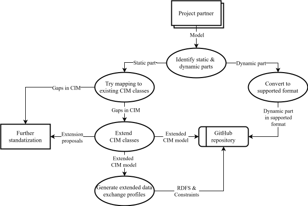

# Public library of IEC CIM/CGMES models

This repository stores and exchanges hybrid AC & DC power system equipment models based on the IEC CIM/CGMES format.

## Structure

- `Data_exchange`: TODO: Add short description.
- `Documentation`: TODO: Add short description.
- `Dynamic_part/`: Contains dynamic part of the model in different formats (Modelica, Matlab, FMI).
- `Test`: TODO: Add short description.

## Usage

 - TODO: Provide instructions on how to use repository.

## Contributing

 - TODO: Provide instructions on how to contribute to repository.

 

 ## License

 TODO: Review https://choosealicense.com/

This project is licensed under the [CC-BY-4.0](LICENSE.md).

## Contact

 - TODO: Add contact information.