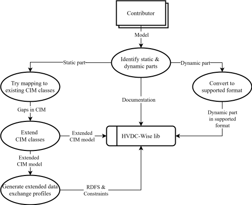

# HVDC-Wise lib

HVDC-Wise lib hosts a library of HVDC equipment models for model exchange, based on the IEC CIM/CGMES standard format. For the purpose of standardized model exchange, the models in the library are split into a *static part* and a *dynamic part*: 
- For the *static part* of a model, the data are exchanged, e.g., model topology and equipment parameters. 
- For the *dynamic part* of a model, the actual model equations and optionally even a solver are exchanged.

## Structure

- [Data_exchange_specifications](Data_exchange_specifications/) contains proposed extensions to IEC Canonical Information Model (CIM) and profiles to support data modelling and exchange of the *static part* and the *dynamic part* of the library's models.
- [Artifacts_&_equations](Artifacts_&_equations/) contains all relevant information categorised per model type. Here you will find artifacts and equations that can be used to realise the exchange of the *dynamic part* of the library's models.
- [Documentation](Documentation) contains documentation for the library models and resources, supporting documentation (e.g. [Images](Documentation/Resources/Images/) or [Templates](Documentation/Resources/Templates/)). This is the place to explore first and get familiar with models that are included in the library. In the description of each of the models' parts of the library you will find information about available open-source implementations and artifacts.

## Usage  

The library accomodates several use cases:

- **Exploring Models**:

     Users that would like to get knowledge on the way of exchanging information using IEC CIM can find real-life examples. To learn more about a specific model refer to [Documentation/Models](Documentation/Models).

- **Using Models in Applications:**

    Users that would like to integrate models in their environment can download and use models in different tools depending on the compatibilities. To use a model in your application, check if the model is available in a suitable format for the application. The library includes several formats for *dynamic part* of the model, such as code in Matlab language, functional mock-up unit (fmu), Modelica code, or CIM-based representations. Since not all models are available in all formats, integrating a model into an application may require manual adjustments. This could involve ensuring compatibility of *static part* or embedding *dynamic part* of the user-defined model within the application. As vendors implement better import functionalities, the integration process will become more streamlined.

- **Standardizing Models:**

    If you are interested in standardizing a model for use in the scope of an association, project, study or at international standard, it is recommended to study all the details and even approach the main contributors for a given model. HVDC-WISE is taking an initiative to disseminate and promote the deliverables for standardization.

The library supports multiple formats for *dynamic part* of the model to ensure long-term interoperability. The usage of library, i.e., using models in applications or standardizing the models can give feedback and further enhance the quality of the library.

## Contributing

### 1. Open an Issue
Start by [creating a new issue](https://github.com/HVDC-WISE/HVDC-components-std-library/issues/new) to propose your model.

### 2. Prepare the Contribution
Create a new branch (e.g., `model-name`) and begin working. 

The contribution should include:

- Model documentation using the [template](Documentation/Resources/Templates/modelTemplate.md).
- *Dynamic part* in one of the supported formats: 
    -  Code (Modelica or Matlab).
    -  Artifact (FMU).
- CIM Extensions (if modeling *static part* requires to extend CIM).

The workflow to prepare the contribution is shown in the figure:
 

### 3. Submit a Pull Request
When your contribution is ready, create a pull request (PR) to merge your branch into the main branch.

### 4. Review and Merge
Your PR will be reviewed by a maintainer. Once approved, your contribution will be merged into the main branch.

 ## License

This project is licensed under the [EUROPEAN UNION PUBLIC LICENCE v. 1.2 (EUPL)](LICENSE).

## Contact
For questions, suggestions, or issues, feel free to reach out via email:

**Email:** coordinator@hvdc-wise.eu

 ## Acknowledgement
HVDC-Wise lib is developed as a part of the HVDC-WISE project.

HVDC-WISE is supported by the European Union’s Horizon Europe programme under agreement 101075424.

UK Research and Innovation (UKRI) funding for HVDC-WISE is provided under the UK government’s Horizon Europe funding guarantee [grant numbers 10041877 and 10051113].
